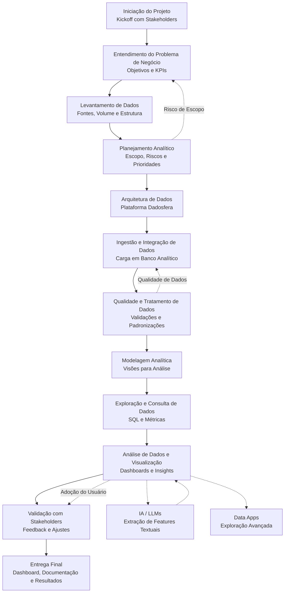

# Item 0 – Agilidade e Planejamento

## Visão Geral
Este artefato representa o planejamento completo do projeto de implementação da Plataforma de Dados, desde a concepção até a entrega, seguindo as boas práticas do PMBOK com execução ágil.

## Artefato de Planejamento – Fluxograma do Projeto
O fluxograma abaixo representa todas as etapas do projeto, suas interdependências e pontos críticos.

## Pontos Críticos e Dependências
- Qualidade dos dados na etapa de ingestão impacta todo o projeto
- Dashboards dependem da modelagem correta
- ML e IA Generativa dependem de dados históricos consistentes
- Data Apps dependem da consolidação das métricas

## Análise de Riscos

| Risco | Impacto | Probabilidade | Estratégia de Mitigação |
|-----|--------|--------------|-------------------------|
| Mudança de escopo | Alto | Médio | Validação contínua com stakeholders |
| Baixa qualidade dos dados | Alto | Médio | Validações na ingestão |
| Baixa adoção do usuário | Médio | Baixo | Dashboards simples e iterativos |
| Atraso na integração | Médio | Baixo | Ingestão incremental |

## Estimativa de Custos

| Categoria | Tipo de Custo |
|---------|---------------|
| Plataforma Dadosfera | OPEX |
| Armazenamento de dados | Variável conforme volume |
| Desenvolvimento | Horas técnicas |
| Manutenção | Incremental |

## Alocação de Recursos

| Papel | Responsabilidade |
|-----|-----------------|
| Data Engineer | Ingestão e pipelines |
| Data Analyst | Análises e dashboards |
| Data Scientist | ML e IA |
| Stakeholders | Validação e decisões |

## Abordagem de Execução
O projeto combina planejamento estruturado (PMBOK) com execução incremental e iterativa, permitindo entregas contínuas e ajustes conforme feedback dos stakeholders.
