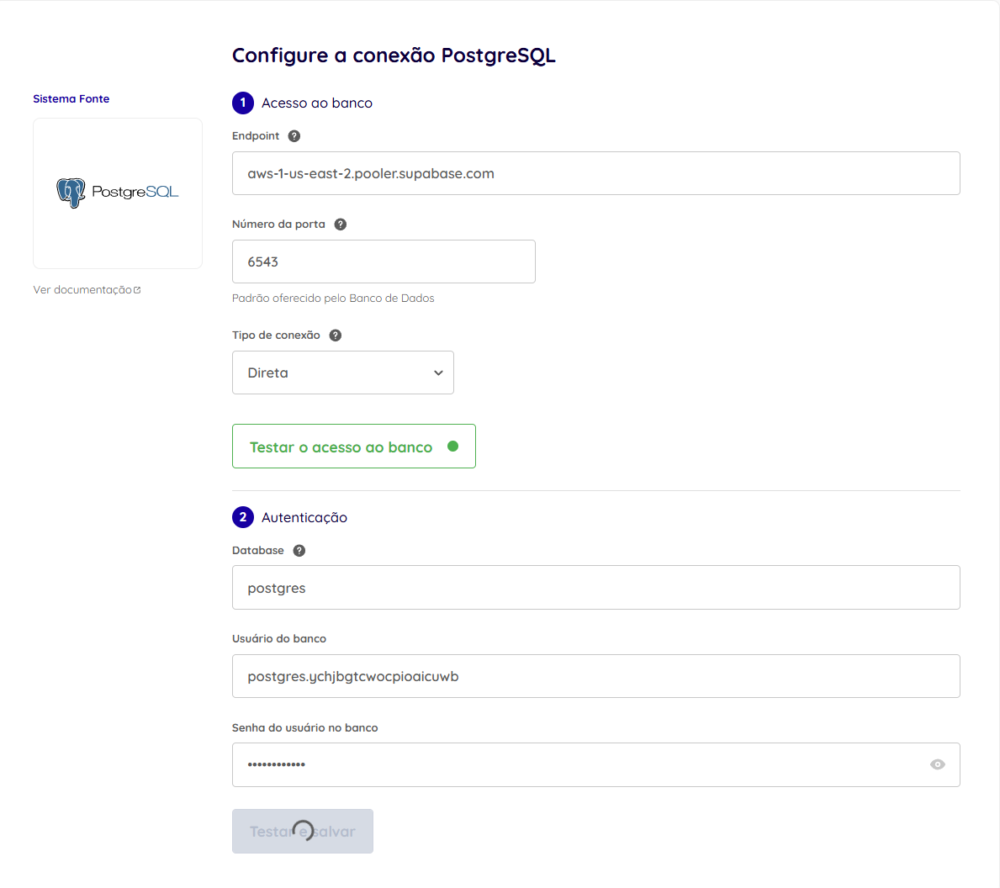
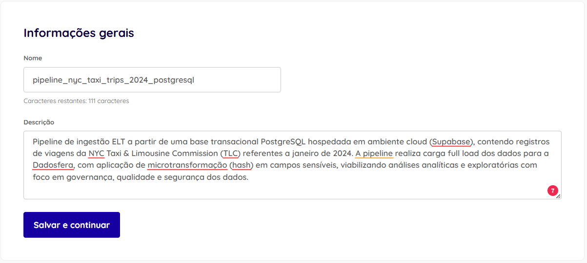
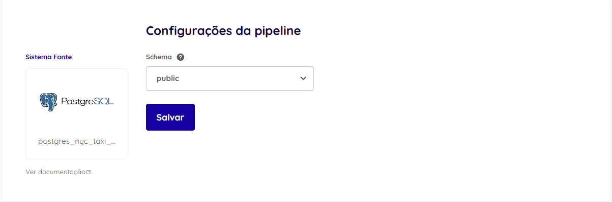
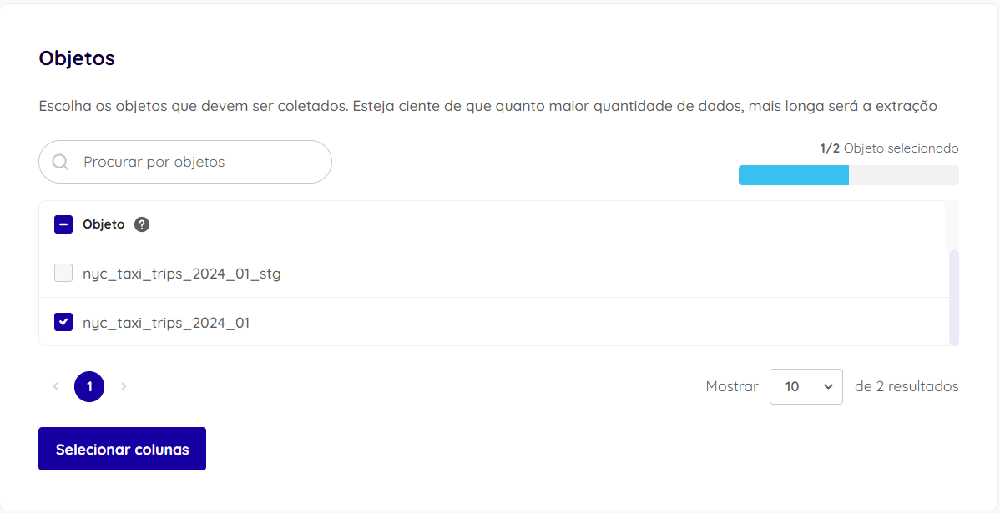
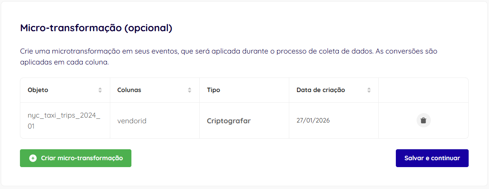
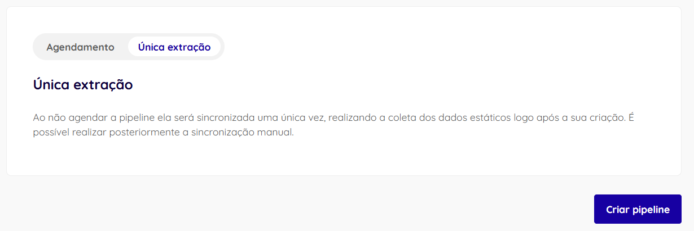
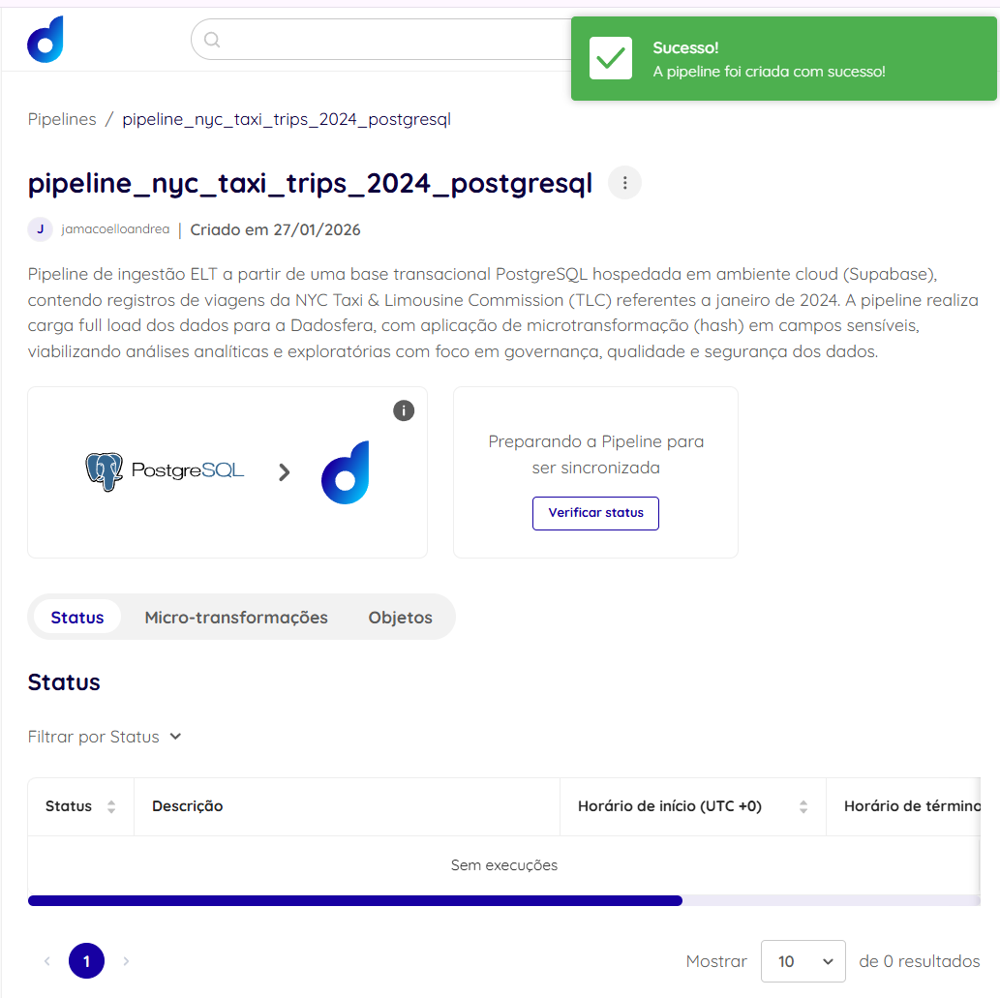
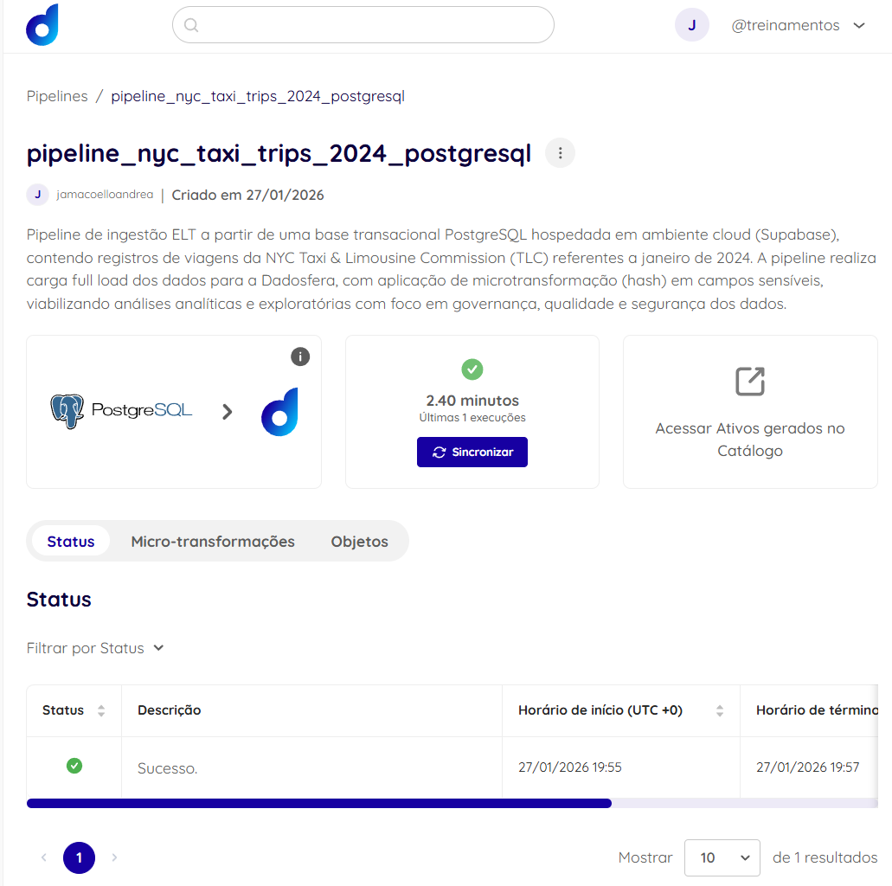

## ⭐ Bônus – Microtransformação com PostgreSQL (Supabase)

Como parte do bônus do case técnico, foi implementada uma pipeline de ingestão de dados a partir de um **banco de dados PostgreSQL em ambiente cloud (Supabase)**, simulando uma **base transacional real**, utilizada como sistema de origem.

O dataset utilizado contém registros de viagens da **NYC Taxi & Limousine Commission (TLC)** referentes a janeiro de 2024, previamente tratados e carregados no PostgreSQL para garantir consistência de tipos e formatos antes da ingestão.

---

### 🔹 Arquitetura adotada

A solução segue o paradigma **ELT (Extract, Load, Transform)**:

- **Extract**: leitura de dados a partir de uma base PostgreSQL transacional  
- **Load**: ingestão dos dados no Data Lake da Dadosfera  
- **Transform**: aplicação de microtransformações durante o processo de coleta  

Essa abordagem permite maior flexibilidade analítica, além de reforçar práticas de **governança, segurança e rastreabilidade dos dados**.

---

### 🔹 Configuração da fonte PostgreSQL

A fonte de dados foi cadastrada na Dadosfera com os seguintes parâmetros:

- **Banco de dados**: PostgreSQL (Supabase – Cloud)
- **Tipo de conexão**: Direta
- **Endpoint**: via Transaction Pooler (IPv4 compatível)
- **Porta**: 6543
- **Database**: `postgres`
- **Usuário**: usuário padrão do Supabase
- **Schema coletado**: `public`\
  

---

### 🔹 Configuração da pipeline

Na criação da pipeline:

- Foi selecionado o objeto **`nyc_taxi_trips_2024_01`**
- Modo de sincronização configurado como **Full Load**

**Justificativa**:
- Dataset histórico
- Base estática para análise exploratória e analítica
- Simplificação do controle de carga para o escopo do case

---

### 🔹 Microtransformação aplicada (Hash)

Durante a configuração da pipeline, foi aplicada uma **microtransformação do tipo _Criptografar (Hash)_** sobre a coluna:

- **Coluna**: `VendorID`
- **Objetivo**:
  - Anonimizar identificadores sensíveis
  - Preservar consistência entre valores repetidos
  - Permitir análises agregadas sem exposição de dados sensíveis

A microtransformação é aplicada **evento a evento** durante a ingestão, garantindo que valores iguais resultem no mesmo hash.

---

### 🔹 Agendamento e execução

A pipeline foi configurada como **Única extração**, executando a coleta imediatamente após a criação.

Essa escolha foi feita por se tratar de um **dataset estático**, adequado ao contexto de demonstração técnica do case, mantendo a possibilidade de reexecução manual se necessário.

---

### 🔹 Resultado final

Após a execução da pipeline:

- Os dados foram ingeridos com sucesso na Dadosfera
- O dataset foi automaticamente **catalogado como Data Asset**
- A coluna `VendorID` passou a apresentar valores **anonimizados (hash)**
- As demais colunas permaneceram intactas, garantindo qualidade e integridade dos dados

---

### 🔹 Considerações finais

Este bônus demonstra, de forma prática:

- Integração entre banco transacional cloud e Data Lake
- Aplicação de **boas práticas de ELT**
- Uso de microtransformações para **segurança e privacidade**
- Capacidade da plataforma em realizar ingestão, transformação e catalogação de forma integrada

O processo reforça uma visão orientada a **governança de dados**, **qualidade** e **escalabilidade**, alinhada a cenários reais de produção.
