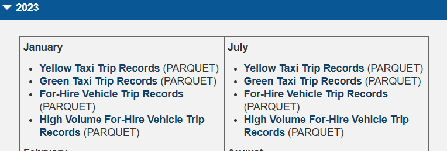
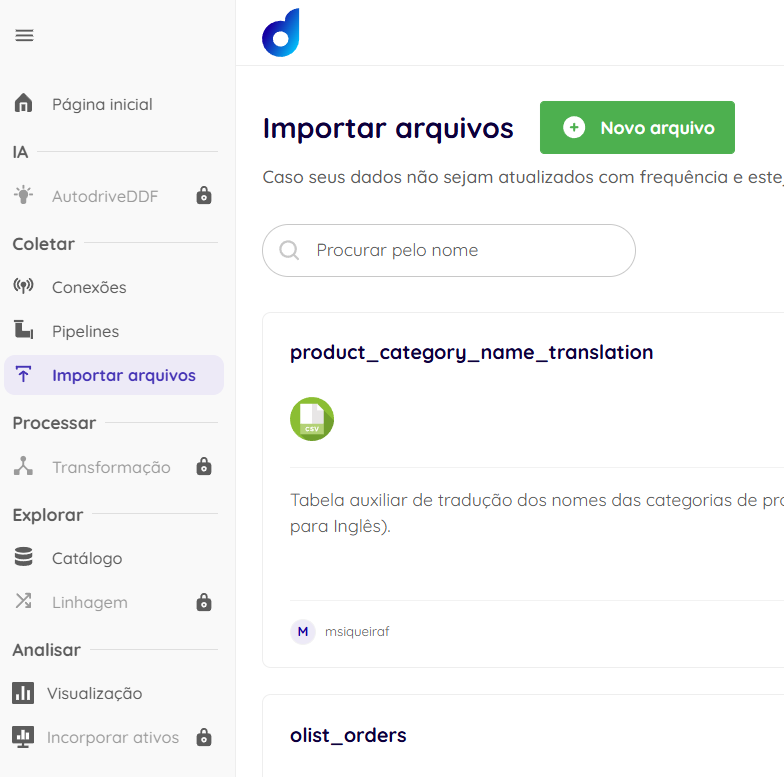
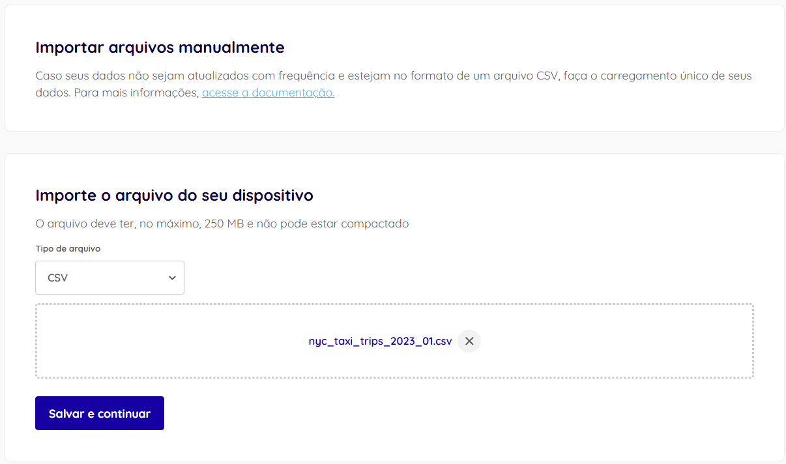
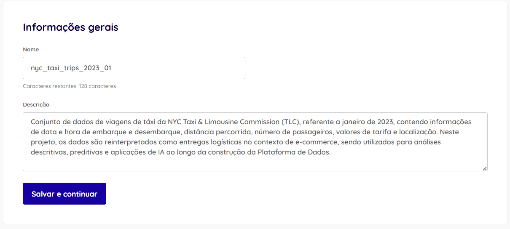
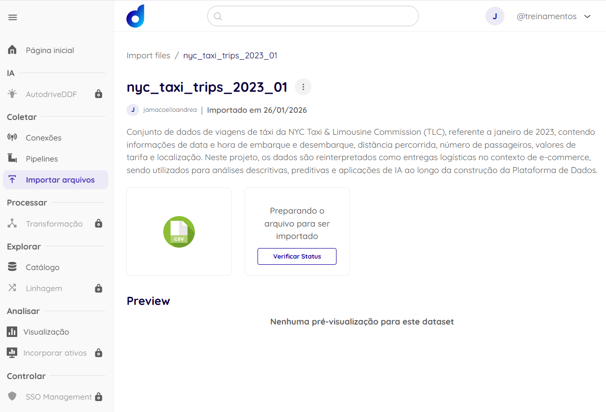

# Item 2.1 – Integração de Dados na Dadosfera

Nesta etapa, foi realizado o carregamento da base de dados proposta para a plataforma Dadosfera, utilizando o módulo de Coleta.

## Fonte de Dados
Base pública da NYC Taxi & Limousine Commission (TLC), contendo milhões de registros de viagens, reinterpretadas neste projeto como entregas logísticas no contexto de e-commerce.

## Preparação do Arquivo para Ingestão

Antes da importação dos dados na Dadosfera, foi realizada uma validação básica da base de dados original em formato Parquet, incluindo verificação de volume e estrutura.

Para facilitar a ingestão manual na plataforma, foi gerado um arquivo CSV a partir de uma amostra de 200.000 registros, mantendo o dado bruto sem transformações analíticas.

O script utilizado para essa preparação encontra-se em:
- `scripts/prepare_nyc_taxi_data.py`

## Método de Coleta
Foi utilizada a importação manual de arquivos CSV, uma vez que se trata de um dataset estático para fins de análise e desenvolvimento do case.

### Importação Manual de Arquivos

Nesta etapa, os dados foram carregados na plataforma Dadosfera por meio da funcionalidade **Importar arquivos**, recomendada para bases de dados estáticas ou que não necessitam de atualização recorrente.

A origem dos dados é o dispositivo local, caracterizando uma coleta única, sem agendamento automático.

### Configurações da Importação

O arquivo importado segue as especificações suportadas pela plataforma, conforme detalhado abaixo:

| Configuração            | Valor Utilizado |
|-------------------------|-----------------|
| Tipo de arquivo         | CSV |
| Codificação             | UTF-8 |
| Separador               | `,` |
| Cabeçalho               | Sim |
| Tamanho do arquivo      | Inferior a 250 MB |

Durante o processo de importação, foi definido um nome e uma descrição para o dataset, permitindo melhor contextualização e governança dos dados no catálogo da plataforma.

### Observação sobre Metadados

No caso de arquivos CSV, a Dadosfera adiciona automaticamente a coluna `_processing_timestamp`, que registra a data e hora em que o dado foi processado pela plataforma. Essa informação é útil para rastreabilidade e análises temporais, especialmente em cenários de sobrescrita ou coletas incrementais.

Após a conclusão da importação, o dataset ficou disponível para visualização e consulta no **Catálogo de Dados** da Dadosfera.

## Microtransformação 

Após a ingestão, foi aplicada uma microtransformação para padronização dos campos e criação de atributos derivados, como o tempo de entrega em minutos, facilitando análises posteriores.

