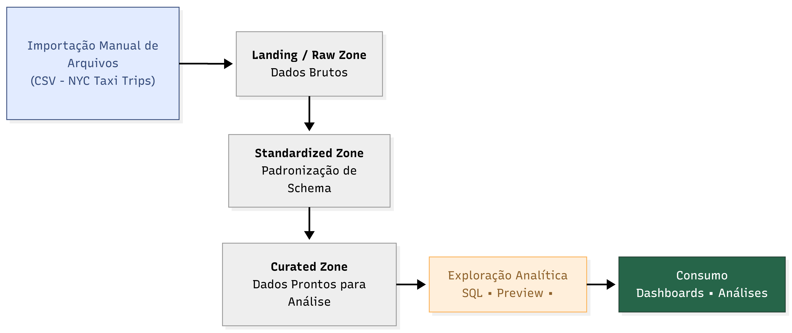
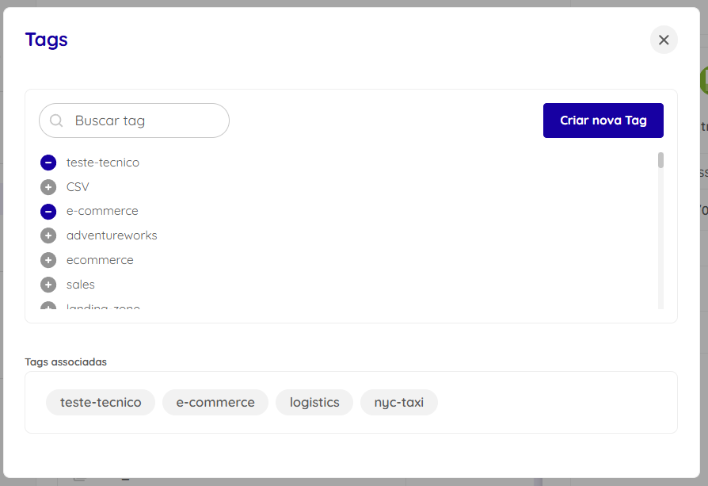
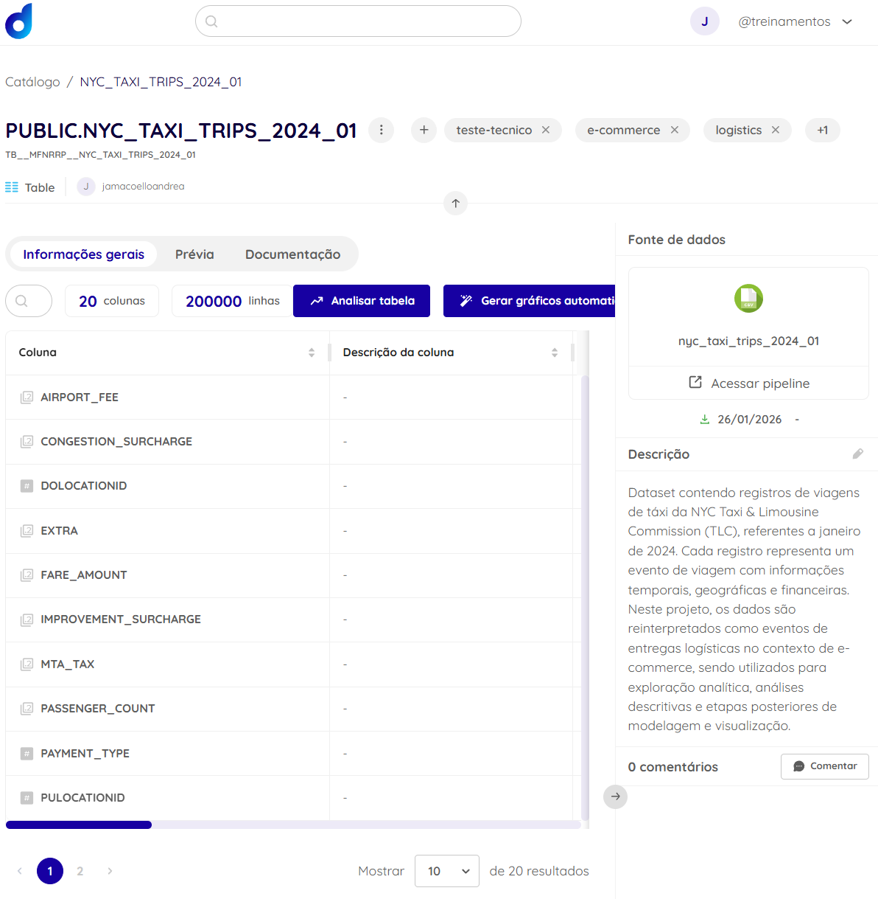

# Item 3 – Exploração e Catalogação dos Dados

Nesta etapa, o dataset foi explorado e catalogado na plataforma Dadosfera, seguindo boas práticas de organização de um Data Lake e governança de dados.

## Organização do Data Lake

Os dados foram inicialmente carregados em sua forma bruta (camada Landing/Raw) por meio da importação manual de arquivos. Após a ingestão, o dataset foi padronizado e disponibilizado no Catálogo de Dados (camada Standardized), ficando apto para exploração analítica e consumo por ferramentas de análise (camada Curated).

## Catalogação do Dataset

O dataset foi devidamente catalogado com nome, descrição e tags, facilitando sua descoberta e reutilização. Também foram adicionadas descrições para os principais campos, compondo um Dicionário de Dados que permite melhor entendimento do significado e uso das informações.

## Dicionário de Dados

Foram documentadas as colunas mais relevantes do dataset, incluindo campos temporais, geográficos e financeiros, garantindo clareza sobre a granularidade dos dados e seus possíveis usos analíticos.

| Coluna                    | Descrição                                                                                                                           |
| ------------------------- | ----------------------------------------------------------------------------------------------------------------------------------- |
| **VendorID**              | Identificador do provedor de tecnologia responsável pelo registro da viagem.                                                        |
| **tpep_pickup_datetime**  | Data e hora em que a viagem foi iniciada (momento de embarque).                                                                     |
| **tpep_dropoff_datetime** | Data e hora em que a viagem foi finalizada (momento de desembarque).                                                                |
| **passenger_count**       | Número de passageiros informados pelo motorista para a viagem.                                                                      |
| **trip_distance**         | Distância percorrida durante a viagem, medida em milhas.                                                                            |
| **RatecodeID**            | Código que identifica o tipo de tarifa aplicada à viagem, como tarifa padrão, tarifa aeroportuária ou tarifas especiais.            |
| **store_and_fwd_flag**    | Indicador que informa se os dados da viagem foram armazenados localmente no veículo antes de serem transmitidos ao sistema central. |
| **PULocationID**          | Identificador da zona geográfica onde ocorreu o embarque da viagem.                                                                 |
| **DOLocationID**          | Identificador da zona geográfica onde ocorreu o desembarque da viagem.                                                              |
| **payment_type**          | Código que identifica a forma de pagamento utilizada pelo passageiro na viagem.                                                     |
| **fare_amount**           | Valor base da tarifa da viagem, sem a inclusão de taxas adicionais.                                                                 |
| **extra**                 | Encargos adicionais aplicados à tarifa base, como taxas noturnas ou de horário de pico.                                             |
| **mta_tax**               | Taxa fixa cobrada pela Metropolitan Transportation Authority (MTA).                                                                 |
| **tip_amount**            | Valor da gorjeta paga pelo passageiro ao motorista.                                                                                 |
| **tolls_amount**          | Valor total de pedágios pagos durante a viagem.                                                                                     |
| **improvement_surcharge** | Taxa fixa destinada a melhorias e manutenção dos serviços de transporte.                                                            |
| **total_amount**          | Valor total pago pelo passageiro, incluindo tarifa base, taxas adicionais, pedágios e gorjeta.                                      |
| **congestion_surcharge**  | Taxa adicional aplicada a viagens realizadas em áreas sujeitas a políticas de congestionamento urbano.                              |
| **airport_fee**           | Taxa adicional aplicada a viagens com origem ou destino em aeroportos.                                                              |

Obs: Os campos financeiros estão expressos em dólares americanos (USD), conforme padrão da NYC Taxi & Limousine Commission.

Essa etapa prepara o dataset para análises descritivas, visualizações e modelagens que serão realizadas nas fases seguintes do projeto.

## Bônus – Catalogação via API

A Dadosfera disponibiliza APIs para automação da catalogação de ativos, permitindo integração com pipelines e processos automatizados de governança.

Neste projeto, a catalogação foi realizada via interface da plataforma. Em um cenário produtivo, essa etapa poderia ser automatizada via API para atualização de descrições, tags e metadados de forma programática.
