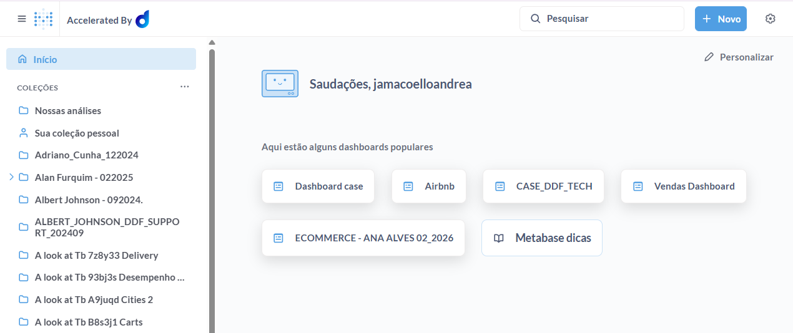
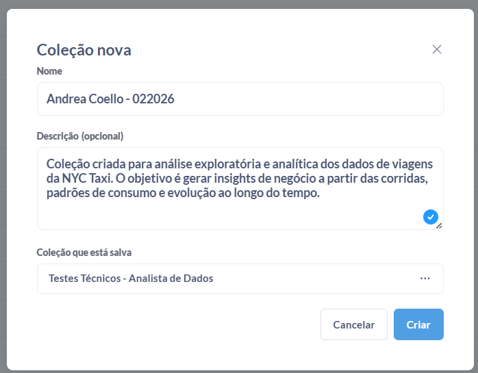
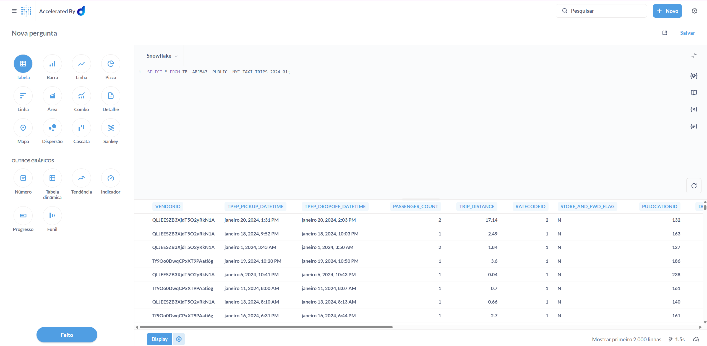
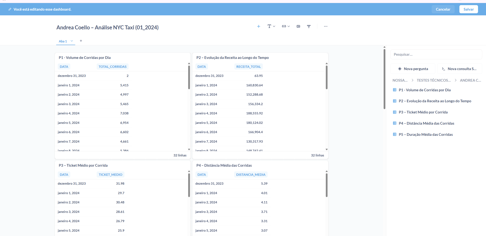
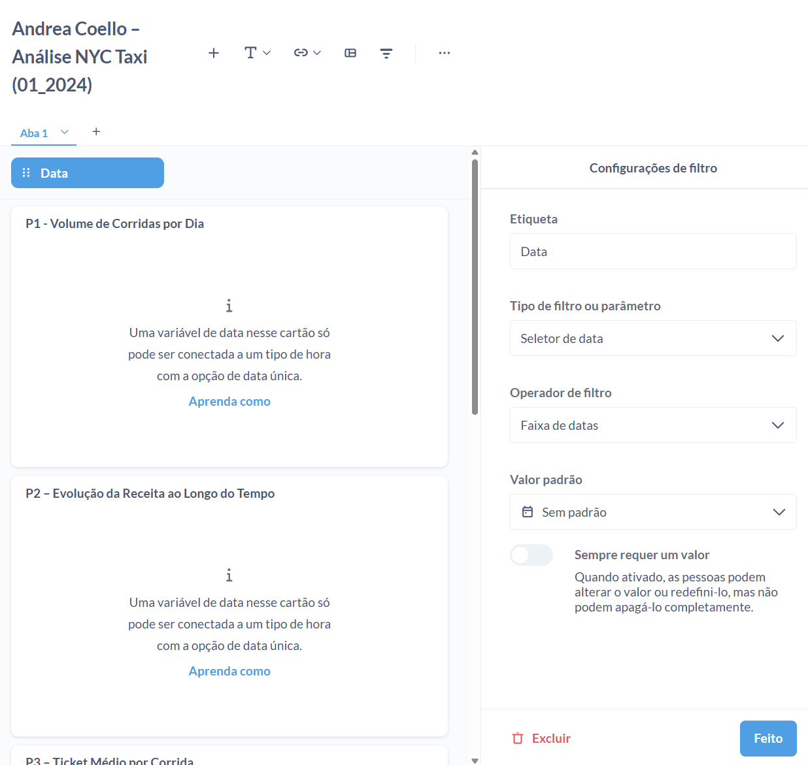
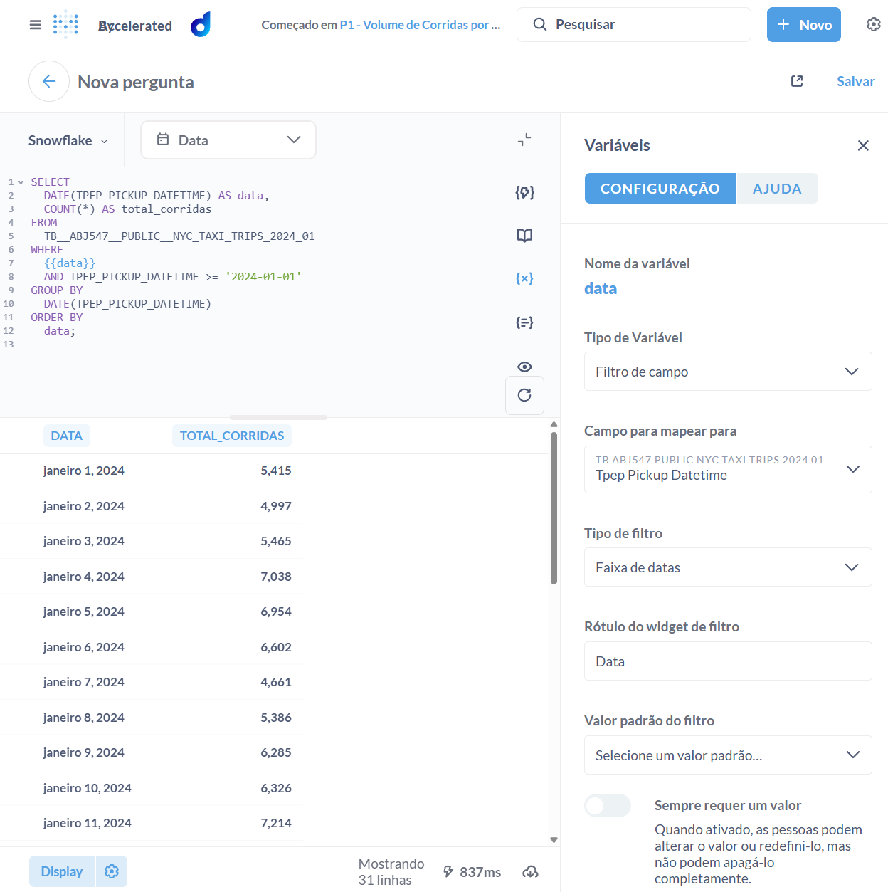
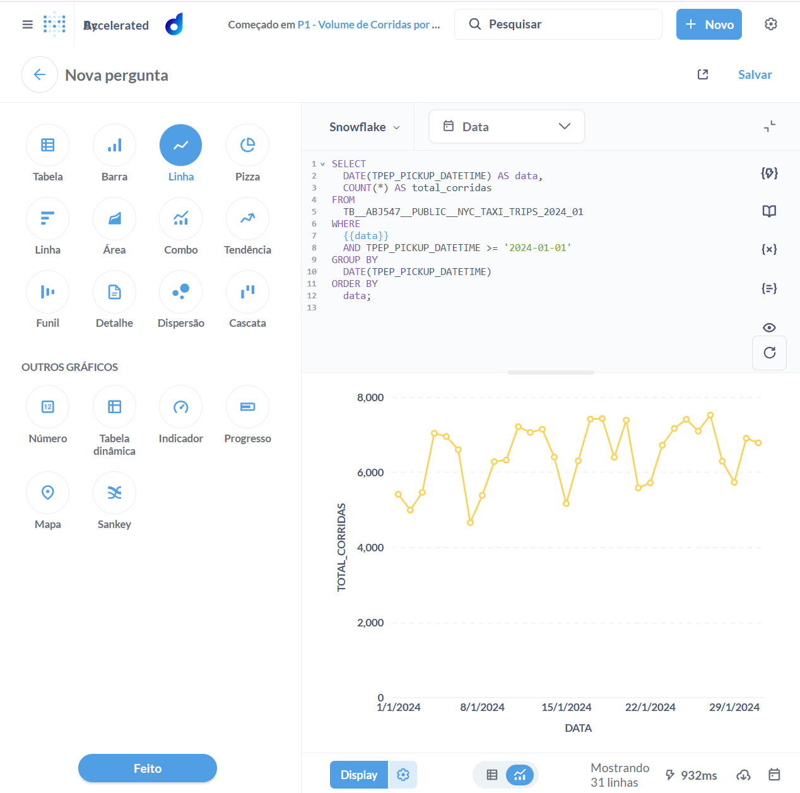

# Item 7 – Análise de Dados (Analisar)

## Objetivo
Nesta etapa, o objetivo foi gerar **valor analítico** a partir da base de dados de corridas de táxi de NYC (Janeiro/2024), combinando métricas operacionais, financeiras e temporais.  
As análises foram construídas utilizando o módulo de **Visualização da Dadosfera**, com foco em responder perguntas de negócio de forma clara e interativa.

---

## Dataset Utilizado
- **Tabela:** `TB_ABJ547__PUBLIC__NYC_TAXI_TRIPS_2024_01`
- **Fonte:** NYC Taxi Trips – Janeiro/2024
- **Granularidade:** Corrida individual
- **Filtro global aplicado:** Data de pickup (`TPEP_PICKUP_DATETIME`)

---

## Estrutura do Dashboard

O dashboard foi organizado em torno de **6 perguntas-chave**, todas conectadas a um **filtro global de data**, permitindo análise dinâmica por intervalo temporal.

### Perguntas Criadas

### P1 – Volume de Corridas por Dia
**Pergunta:**  
> Como evolui o volume de corridas ao longo do tempo?

- Métrica: Quantidade de corridas
- Visualização: Linha
- Insight esperado: Identificação de padrões diários e variações de demanda

---

### P2 – Evolução da Receita ao Longo do Tempo
**Pergunta:**  
> Como a receita total se comporta ao longo do período analisado?

- Métrica: Soma de `TOTAL_AMOUNT`
- Visualização: Área / Linha
- Insight esperado: Relação entre volume de corridas e geração de receita

---

### P3 – Ticket Médio por Corrida
**Pergunta:**  
> Qual é o valor médio pago por corrida?

- Métrica: Ticket médio (`AVG(TOTAL_AMOUNT)`)
- Visualização: KPI (Número)
- Insight esperado: Avaliação do valor médio transacionado por viagem

---

### P4 – Distância Média das Corridas
**Pergunta:**  
> Qual é a distância média percorrida por corrida?

- Métrica: Média de `TRIP_DISTANCE`
- Visualização: KPI (Número)
- Unidade: Milhas
- Insight esperado: Compreensão do perfil das viagens realizadas

---

### P5 – Duração Média das Corridas
**Pergunta:**  
> Quanto tempo, em média, dura uma corrida?

- Métrica: Diferença média entre `TPEP_DROPOFF_DATETIME` e `TPEP_PICKUP_DATETIME`
- Visualização: Barras (por data)
- Unidade: Minutos
- Insight esperado: Análise de eficiência e fluidez das corridas

---

### P6 – Distribuição por Tipo de Pagamento
**Pergunta:**  
> Como as corridas se distribuem entre os diferentes tipos de pagamento?

- Dimensão: `PAYMENT_TYPE`
- Métrica: Contagem de corridas
- Visualização: Pizza / Donut
- Insight esperado: Entendimento do comportamento de pagamento dos usuários

---

## Filtros Aplicados no Dashboard

- **Filtro Global:** Data
  - Campo: `TPEP_PICKUP_DATETIME`
  - Tipo: Faixa de datas
  - Aplicado a todas as perguntas do dashboard
- O uso de um filtro único garante **consistência analítica** entre todas as visualizações.

---

## Arquivos do Projeto

### 📄 Queries SQL
Todas as consultas SQL utilizadas para gerar as visualizações deste item estão documentadas no arquivo:

-- `analise_dados_process.md`

## Visualização Final – Dashboard Analítico

Como resultado desta etapa, foi construído um **dashboard analítico interativo** no módulo de Visualização da Dadosfera, consolidando as principais métricas operacionais e financeiras das corridas de táxi de NYC (Janeiro/2024).

O dashboard permite:
- Análise temporal dinâmica via filtro de data
- Visão integrada entre volume de corridas, receita, ticket médio, distância e duração
- Exploração do comportamento de pagamento dos usuários

### 📊 Visão Geral do Dashboard

> **Observação:** a imagem acima representa a visão final do dashboard após a consolidação das 6 perguntas analíticas.

---

### Estrutura do Dashboard
O dashboard final é composto por:

- **P1:** Volume de Corridas por Dia  
- **P2:** Evolução da Receita ao Longo do Tempo  
- **P3:** Ticket Médio por Corrida  
- **P4:** Distância Média das Corridas  
- **P5:** Duração Média das Corridas  
- **P6:** Distribuição por Tipo de Pagamento  

Todos os gráficos estão conectados a um **filtro global de data**, garantindo consistência e análise comparável entre as visualizações.

---

### Considerações Finais
Esta visualização consolida a etapa de **Análise de Dados**, demonstrando a capacidade de:
- Transformar dados brutos em indicadores de negócio
- Criar dashboards interativos orientados à tomada de decisão
- Utilizar a plataforma Dadosfera como elo entre dados e valor analítico

