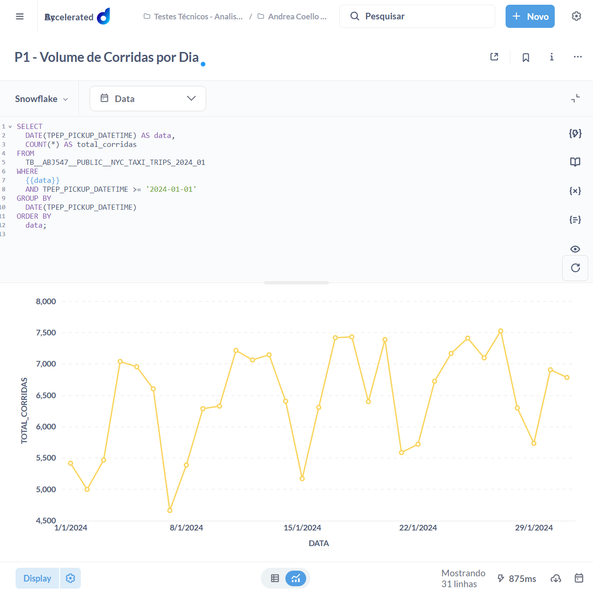
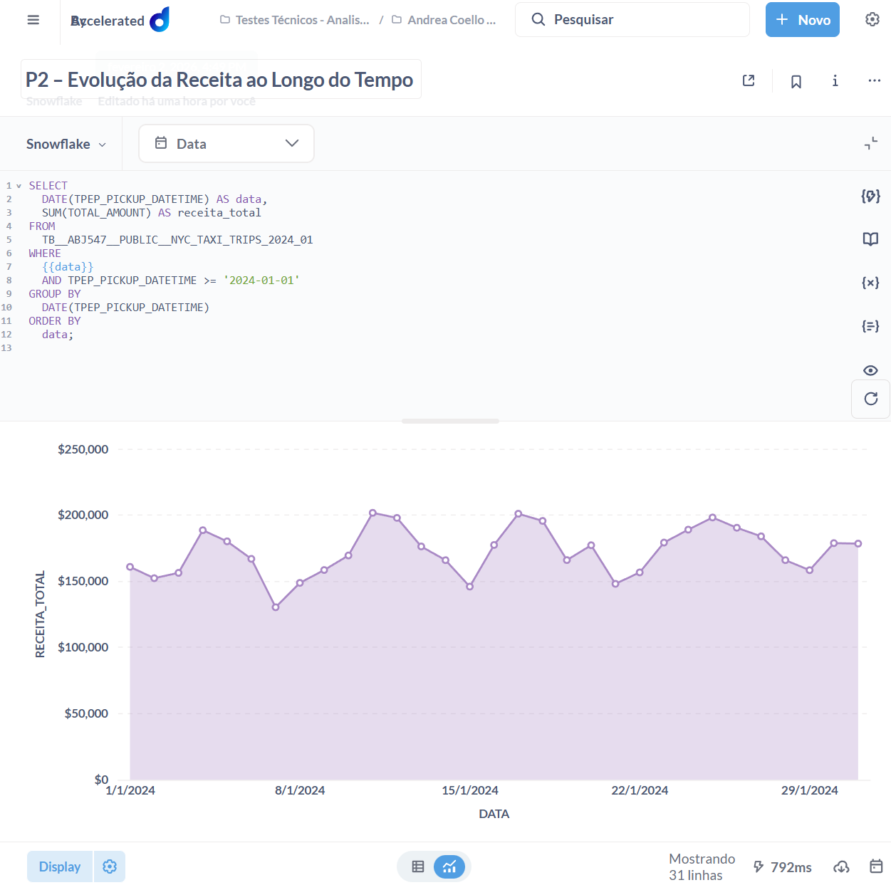

## P1 - Volume de Corridas por Dia

```
DATE(TPEP_PICKUP_DATETIME) AS data,
  COUNT(*) AS total_corridas
FROM
  TB__ABJ547__PUBLIC__NYC_TAXI_TRIPS_2024_01
WHERE
  {{data}}
  AND TPEP_PICKUP_DATETIME >= '2024-01-01'
GROUP BY
  DATE(TPEP_PICKUP_DATETIME)
ORDER BY
  data;
```



## P2 – Evolução da Receita ao Longo do Tempo 

```
SELECT
  DATE(TPEP_PICKUP_DATETIME) AS data,
  SUM(TOTAL_AMOUNT) AS receita_total
FROM
  TB__ABJ547__PUBLIC__NYC_TAXI_TRIPS_2024_01
WHERE
  {{data}}
  AND TPEP_PICKUP_DATETIME >= '2024-01-01'
GROUP BY
  DATE(TPEP_PICKUP_DATETIME)
ORDER BY
  data;
```


