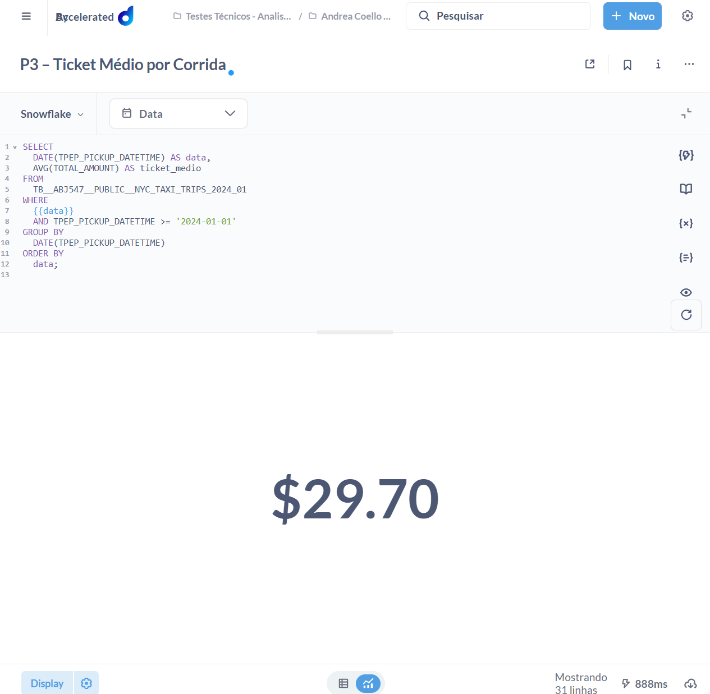
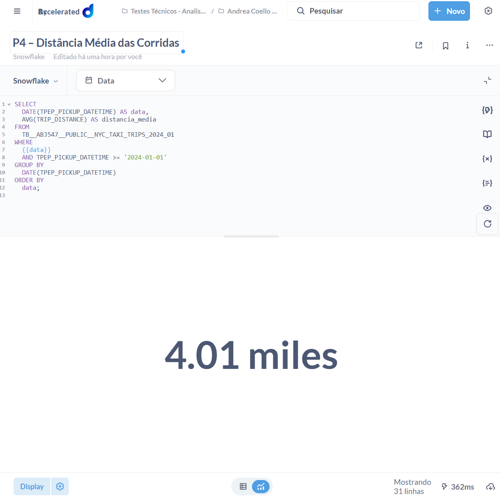
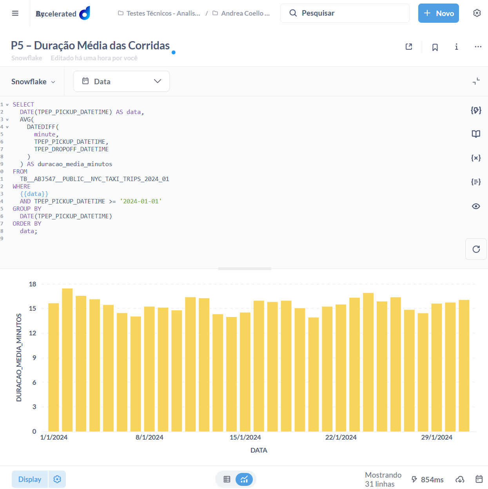
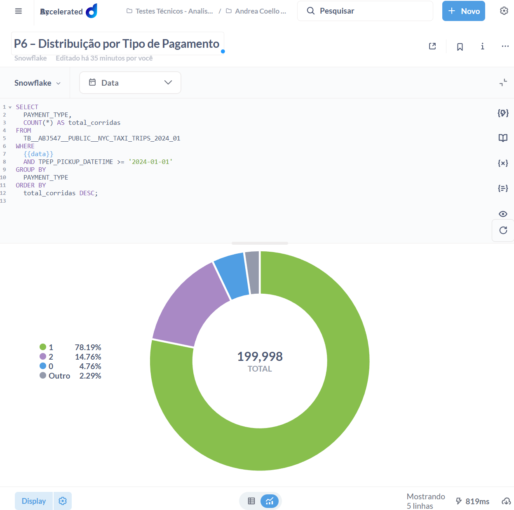

## P1 - Volume de Corridas por Dia

```
DATE(TPEP_PICKUP_DATETIME) AS data,
  COUNT(*) AS total_corridas
FROM
  TB__ABJ547__PUBLIC__NYC_TAXI_TRIPS_2024_01
WHERE
  {{data}}
  AND TPEP_PICKUP_DATETIME >= '2024-01-01'
GROUP BY
  DATE(TPEP_PICKUP_DATETIME)
ORDER BY
  data;
```


## P2 – Evolução da Receita ao Longo do Tempo 

```
SELECT
  DATE(TPEP_PICKUP_DATETIME) AS data,
  SUM(TOTAL_AMOUNT) AS receita_total
FROM
  TB__ABJ547__PUBLIC__NYC_TAXI_TRIPS_2024_01
WHERE
  {{data}}
  AND TPEP_PICKUP_DATETIME >= '2024-01-01'
GROUP BY
  DATE(TPEP_PICKUP_DATETIME)
ORDER BY
  data;
```


## P3 – Ticket Médio por Corrida 

```
SELECT
  DATE(TPEP_PICKUP_DATETIME) AS data,
  AVG(TOTAL_AMOUNT) AS ticket_medio
FROM
  TB__ABJ547__PUBLIC__NYC_TAXI_TRIPS_2024_01
WHERE
  {{data}}
  AND TPEP_PICKUP_DATETIME >= '2024-01-01'
GROUP BY
  DATE(TPEP_PICKUP_DATETIME)
ORDER BY
  data;
```



## P4 – Distância Média das Corridas 

```
SELECT
  DATE(TPEP_PICKUP_DATETIME) AS data,
  AVG(TRIP_DISTANCE) AS distancia_media
FROM
  TB__ABJ547__PUBLIC__NYC_TAXI_TRIPS_2024_01
WHERE
  {{data}}
  AND TPEP_PICKUP_DATETIME >= '2024-01-01'
GROUP BY
  DATE(TPEP_PICKUP_DATETIME)
ORDER BY
  data;
```



## P5 – Duração Média das Corridas 

```
SELECT
  DATE(TPEP_PICKUP_DATETIME) AS data,
  AVG(
    DATEDIFF(
      minute,
      TPEP_PICKUP_DATETIME,
      TPEP_DROPOFF_DATETIME
    )
  ) AS duracao_media_minutos
FROM
  TB__ABJ547__PUBLIC__NYC_TAXI_TRIPS_2024_01
WHERE
  {{data}}
  AND TPEP_PICKUP_DATETIME >= '2024-01-01'
GROUP BY
  DATE(TPEP_PICKUP_DATETIME)
ORDER BY
  data;
```



## P6 – Distribuição por Tipo de Pagamento 

```
SELECT
  PAYMENT_TYPE,
  COUNT(*) AS total_corridas
FROM
  TB__ABJ547__PUBLIC__NYC_TAXI_TRIPS_2024_01
WHERE
  {{data}}
  AND TPEP_PICKUP_DATETIME >= '2024-01-01'
GROUP BY
  PAYMENT_TYPE
ORDER BY
  total_corridas DESC;
```


