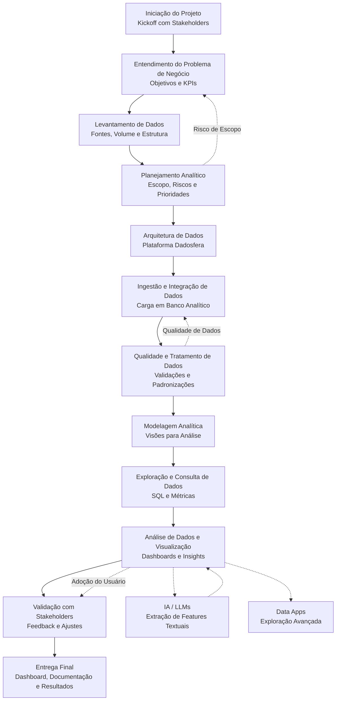

# Case Técnico – Plataforma de Dados para E-commerce
**Candidato:** Andrea Coello  
**Vaga:** Analista de Dados  
**Empresa:** Dadosfera  

## Objetivo
Este projeto apresenta a implementação de uma Plataforma de Dados utilizando a Dadosfera, com foco em centralizar fontes de dados de um e-commerce para análises descritivas, prescritivas e uso de IA.

## Contexto do Negócio
O cliente é uma empresa de e-commerce com alto investimento em mídia paga, operação logística própria e necessidade de decisões baseadas em dados confiáveis e acessíveis.

## Estrutura do Projeto
O repositório está organizado seguindo o ciclo de vida dos dados proposto pela Dadosfera:
1. Integrar  
2. Processar  
3. Explorar  
4. Qualidade dos dados 
5. Features  
6. Modelagem 
7. Dashboard 

## Tecnologias Utilizadas
- SQL
- Python
- Google Colab
- Github
- Supabase - PostgreSQL
- Mermaid

## Fluxograma do projeto

